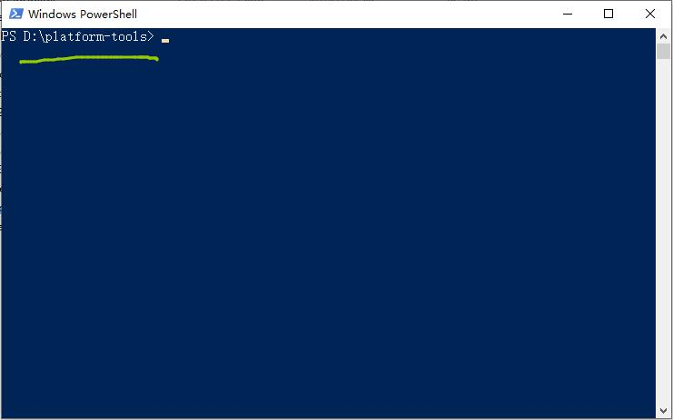

## 准备工作
- 一台电脑
- 一条数据线

### 1. 激活开发者设置
- 在系统设置里连续点击系统版本（软件版本，不是Android版本），直到提示开发者模式已激活
- 在系统设置里找到开发者选项，并勾选【USB调试】

> 下图以MIUI为例，其它UI可能有所不同，但基本类似

### 2. 获得电脑上的ADB工具
> 此处以Windows为例，但不仅限于Windows

- 首先，你得有一个 `platform-tools` 工具包，它是`Android SDK`的一部分
- 如果你还没有，可点击下方链接下载工具包，并解压到电脑上
  [platform-tools 工具包](https://www.lanzous.com/ib6mxda)
- 在`[platform-tools 工具包`解压目录下，按住键盘的`Shit键`，并点击鼠标右键
  

- 如果是 Windows 10，则点击 `在此处打开 Powershell 窗口`
- 如果是 Windows 7，则点击 `在此处打开 命令行窗口`
- 点击后打开的界面基本就是长这样（Powershell是蓝色，命令行窗口是黑色）
- 窗口顶部的路径就是我们`[platform-tools 工具包`所在的位置、
  

### 3. 执行命令
- 点击Gesture 增强模式右侧的机器人小图标
- 复制Gesture提示的脚本代码，发送到电脑，粘贴到刚刚打开的命令行窗口，并按下回车
  - 如果你的手机是首次和电脑连接，会出现授权提示，此时需要你在手机上点击确认
  - 确认完之后，你可能需要在命令行窗口再次执行刚刚的代码
  - 如果你小心误操作错过了手机上弹出的授权窗口，emmm，如果你是萌新，我建议你重启手机和电脑从头再来一次。如果你是经验丰富的老鸟，当我没说。
- 总之，如果成功，Gesture界面上的机器人小图标会变成绿色

### 其它
- 如果我说的不是很清楚，也没有关系，问问你身边有没有高手
- 让他们帮帮你也是很简单的