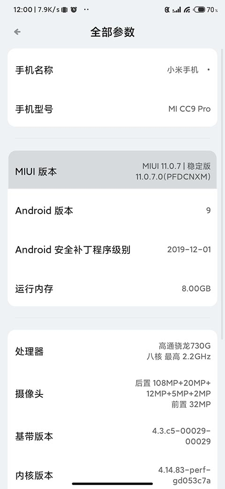
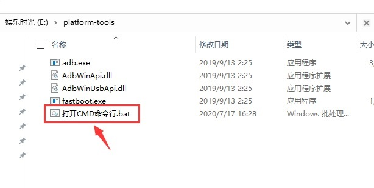
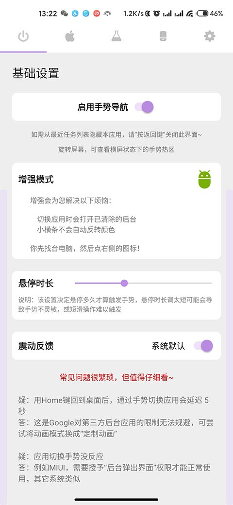

## 准备工作
- 一台电脑
- 一条数据线
- 以下是图文教程（如果看不到图片，可以尝试科学上网，或者更换不同运营商的网络）

### 1. 激活开发者设置
- 在系统设置里连续点击系统版本（软件版本，不是Android版本），直到提示开发者模式已激活
- 在系统设置里找到开发者选项，并勾选【USB调试】

> 下图以MIUI为例，其它UI可能有所不同，但基本类似




### 2. 获得电脑上的ADB工具
> 此处以Windows为例，但不仅限于Windows

- 首先，你得下载`platform-tools`（如果你有其他手机助手软件附带ADB工具，也可以直接使用）
- 下载[platform-tools](https://omarea.lanzous.com/iDi6Teongtg)，`并解压到电脑上`
- 双点击解压目录下的 `打开CMD命令行.bat` 打开ADB命令窗口



### 3. 执行命令
- 点击**Gesture**增强模式右侧的机器人小图标，出现激活提示弹窗后，插上数据线连接电脑
- 复制激活命令
  ```sh
  adb -d shell sh /storage/emulated/0/Android/data/com.omarea.gesture/cache/up.sh
  ```
- 并在命令行窗口中点击鼠标右键粘贴代码，并按下回车键

  - 如果你的手机是首次和电脑连接，会出现授权提示，此时需要你在手机上点击确认
  - 确认完之后，你可能需要重复刚刚的动作
  - 如果你小心误操作错过了手机上弹出的授权窗口。你是新手的话，建议重启手机和电脑从头再来一次。经验丰富的老鸟随意。
- 总之，如果激命令执行成功后，Gesture主页的机器人图标会变成绿色




### 4. 疑难问题
- 拔掉数据线增强模式就失效了？
  > 这的确是个难以解决的问题，在Oreo+系统上极容易出现。<br />
  > 有网友建议，手机插上电脑后，把连接模式改成“仅充电”，再执行代码。


### 其它
- 如果我说的不是很清楚，也没有关系，问问你身边有没有高手
- 让他们帮帮你也是很简单的